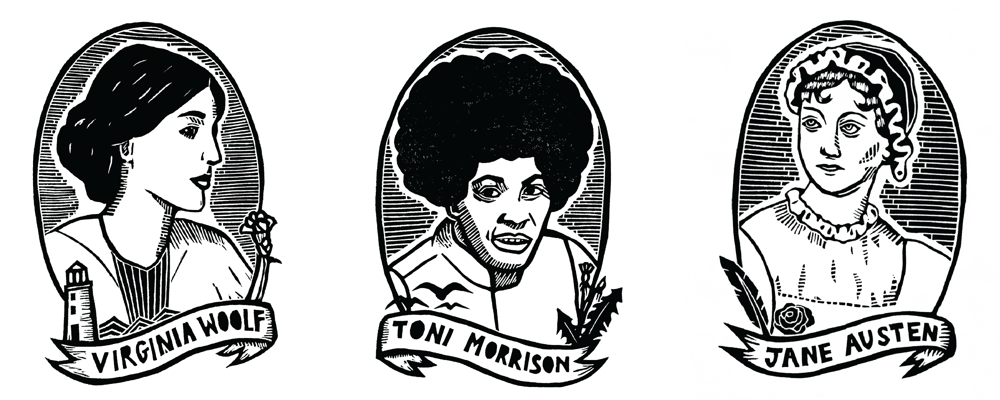

Outside of research, I am an avid printmaker, graphic designer, and photographer. Please shoot me a [message](/contact/) if you're interested in commissioning a piece!

&nbsp;

Below you can find examples of my work.

## prints ##

## graphic design ##

{: width="50%"}

    

     
      Winning sticker design for the 30th Anniversary of the Geosciences Student Research Symposium at Virginia Tech
     
    

 

  
  

    

     
      Official sticker and bookmark branding for the <a href="https://brynmawrbookstore.com/">Bryn Mawr Bookstore</a> in Cambridge, MA
     
    

 

## photography ##

