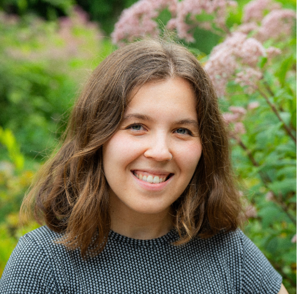

I am a Postdoctoral Associate at Virginia Tech, working in the Center for Ecosystem Forecasting in the Biological Sciences Department. My research focuses on incorporating satellite remote sensing data into near-term forecasting models to improve accuracy and transferability.

{: width="50%" }

I completed my Ph.D. in the Geosciences department at Virginia Tech in 2025, working with Dr. George Allen in the Global Rivers Group. My dissertation focused on exploring innovative applications of remote sensing data to study sediment transport. To learn more about my research, click [here](/research/).

I graduated from Dartmouth College in 2021 with a B.A. in Earth Sciences and a minor in English. My senior thesis examined alluvial fans in Martian craters and received highest honors.

My full CV may be viewed here ...